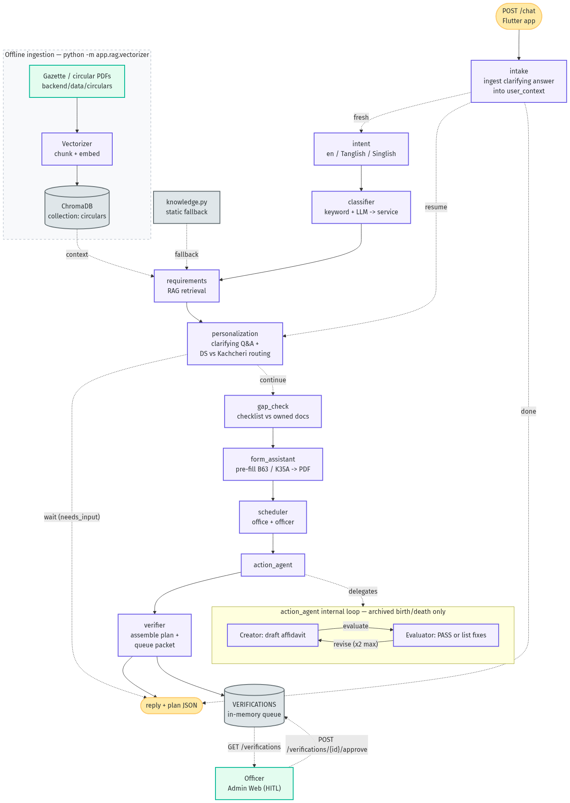
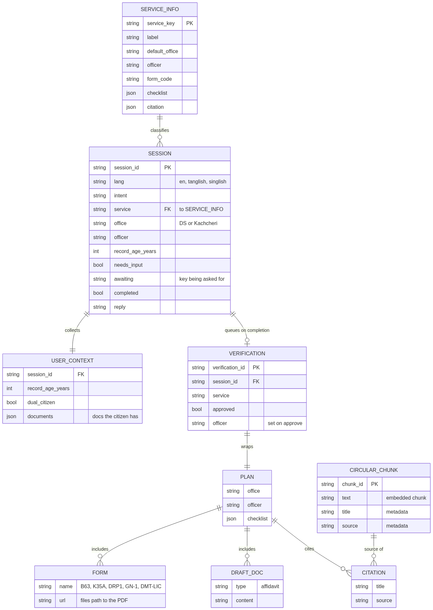
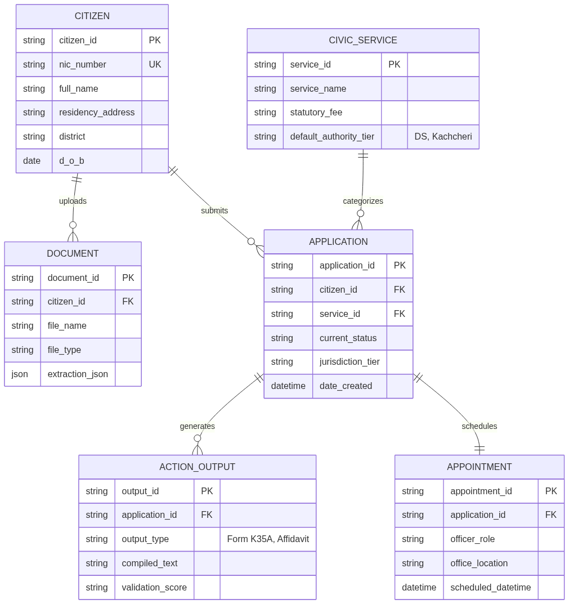
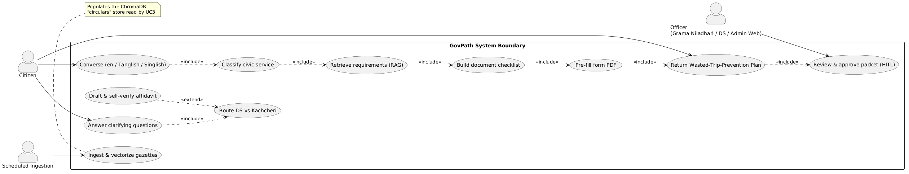
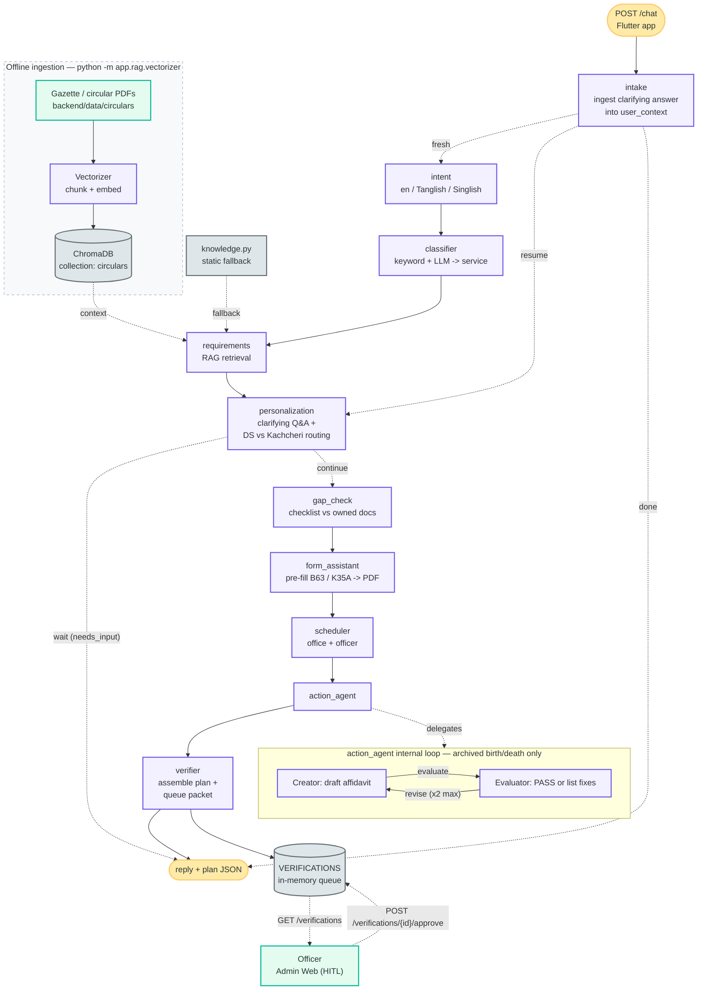
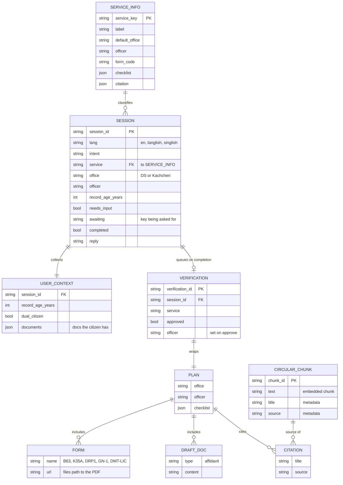
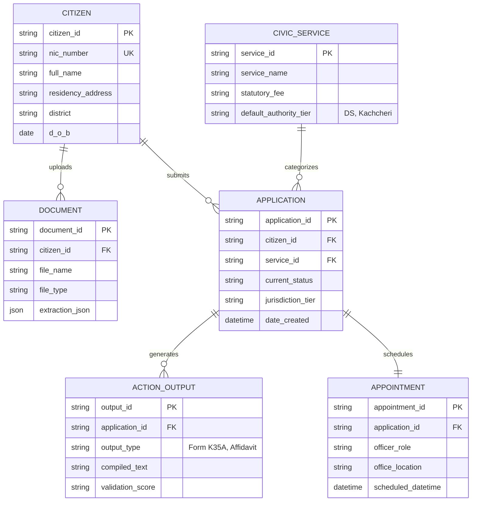
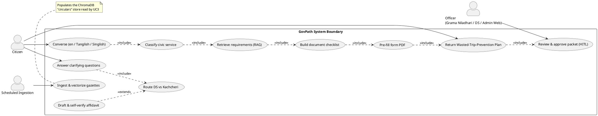

# GovPath — Final-Report Diagrams (grounded in the codebase)

These three diagrams are an exact reconstruction of what is implemented in `backend/`.
Mermaid blocks render natively on GitHub and at https://mermaid.live; the PlantUML block
renders at http://www.plantuml.com/plantuml.

**Pre-rendered PNGs** (drop straight into the report; sources are the `.mmd`/`.puml` files
beside this doc):

| Deliverable | Source | Image |
|---|---|---|
| 1. Architecture / multi-agent flow | `govpath-architecture.mmd` | `govpath-architecture.png` |
| 2a. ER — as-built | `govpath-er-asbuilt.mmd` | `govpath-er-asbuilt.png` |
| 2b. ER — production target | `govpath-er-target.mmd` | `govpath-er-target.png` |
| 3. Use-case | `govpath-usecase.puml` | `govpath-usecase.png` |

Re-render anytime: Mermaid → `https://mermaid.ink/img/<base64-of-source>` or mermaid.live;
PlantUML → Kroki `curl -X POST https://kroki.io/plantuml/png --data-binary @govpath-usecase.puml`.

**Code-alignment map** (so reviewers can trace every node to a file):

| Diagram node | Source | Notes |
|---|---|---|
| `intake`, `intent`, `classifier`, `requirements`, `personalization`, `gap_check`, `form_assistant`, `scheduler`, `action_agent`, `verifier` | `backend/app/graph/agents/*.py` | one `run(state)->state` fn each |
| graph wiring, `fresh`/`resume`/`done`, `wait`/`continue` | `backend/app/graph/graph.py` | `StateGraph` + conditional edges |
| RAG retrieval / ChromaDB `circulars` | `backend/app/rag/retriever.py`, `vectorizer.py` | ingestion is an **offline** script |
| static fallback knowledge | `backend/app/graph/knowledge.py` | used when RAG/LLM unavailable |
| `VERIFICATIONS` queue + HITL | `backend/app/models/store.py`, `backend/app/api/routes.py` | `GET /verifications`, `POST /verifications/{id}/approve` |
| `SESSION` state model | `backend/app/graph/state.py` (`GraphState`) | held in `SESSIONS` dict |

---

## Deliverable 1 — System Architecture & Multi-Agent Flow

> Accurate to `app/graph/graph.py`: a single LangGraph state machine entered at `intake`,
> with conditional routing, a linear action pipeline, the Creator/Evaluator loop **inside**
> `action_agent`, and Human-in-the-Loop happening **after** the verifier queues the packet.

---

## Deliverable 2 — Entity / Data Model

### 2a. As-built (what the code actually stores)

> The current build is **stateful in-memory** (`SESSIONS`, `VERIFICATIONS` dicts in
> `app/models/store.py`) plus a **ChromaDB** vector store — no SQL database yet. Fields map
> 1:1 to `GraphState` (`app/graph/state.py`) and the verifier packet.

### 2b. Production target (future — relational/SQLite)

> Not implemented in the hackathon build (kept here as the migration target if state moves
> from in-memory dicts to a relational store). Mirrors the handed schema.

---

## Deliverable 3 — Use-Case Diagram

> Actors and use cases mapped to real features. Syntax fixed from the template
> (`@enduml`, valid `..>` relations). `action_agent`'s affidavit is an **extend** because it
> only fires for archived (>= 20 yr) birth/death records.

---

### Honesty notes for the pitch (defensible vs. over-claiming)

- The **action pipeline is linear**, not a 3-way fan-out — `gap_check -> form_assistant ->
  scheduler -> action_agent`. (Easy to defend; matches `graph.py`.)
- The **Creator/Evaluator loop** is real but lives **inside** `action_agent` (a draft ->
  evaluate -> revise loop, max 2 iterations) and runs only for archived birth/death records.
- **HITL** is a real REST gate (`/verifications` + `/approve`) that happens **after** the
  verifier queues the packet — the officer authorizes from the Admin Web.
- **Persistence** is in-memory dicts + ChromaDB today; the relational ER (2b) is the stated
  next step, not a current claim.
